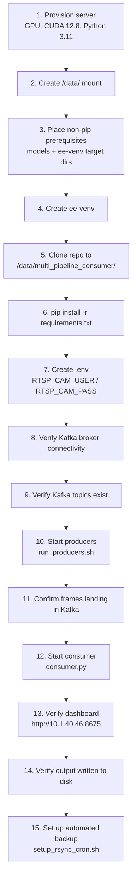

# Deployment Guide — Plaksha Streams Multi-Pipeline Consumer

This document covers everything needed to deploy this system on a fresh GPU server, from
non-pip prerequisites through rollback procedure. For architecture and day-to-day operation,
see the root [`README.md`](README.md) and [`consumers/README.md`](consumers/README.md).



---

## 1. System Specifications

| Item | Value | Source |
|---|---|---|
| GPU model | NVIDIA L40S, 48GB VRAM | `consumers/consumer.py` header, `consumers/README.md` |
| CUDA version | 12.8 | `requirements.txt` (`torch==2.8.0+cu128`) |
| Python version | 3.11 | `requirements.txt` header comment |
| OS | [VERIFY] — not documented anywhere in this repository | — |
| RAM | [VERIFY] — not documented anywhere in this repository | — |
| Storage root | `/data/` | `BASE_OUTPUT_DIR`, model paths, `ee-venv` all live under `/data/` |
| Virtual environment | `ee-venv` at `/data/Entry_Exit/ee-venv` | `scripts/run_consumer.sh`, `scripts/run_producers.sh` |

---

## 2. Network Topology

| Service | Host / IP | Port | Notes |
|---|---|---|---|
| GPU server (consumer + producers run here) | `10.1.41.56` | — | Runs `ee-venv`, all producer/consumer processes |
| Kafka broker 1 | `10.1.40.43` | `9092` | |
| Kafka broker 2 | `10.1.40.44` | `9093` | |
| Kafka broker 3 | `10.1.40.45` | `9094` | 3-broker cluster, `BROKERS` constant in `consumer.py` line 101 |
| Dashboard (Flask-SocketIO) | `10.1.40.46` | `8675` | Confirmed authoritative per root `README.md`; **note:** `scripts/run_consumer.sh` logs a stale `10.1.41.56:8675` — see Known Server Quirks (§8) |
| HPC-1 (CSV backup destination) | `10.1.40.43` | SSH (22) | Same IP as Kafka broker 1 — shared host, different service (rsync target at `/home/administrator/plaksha_streams_hpc1/plaksha_day_wise_csv`) |
| RTSP cameras | `10.1.34.xx` / `10.1.35.xx` subnet | `554` | 10 cameras — see Camera Registry (§3) |
| RTSP credentials | `[REDACTED]` | — | `RTSP_CAM_USER` / `RTSP_CAM_PASS`, loaded from repo-root `.env` — see §5. Never hardcoded, never logged in full (URL should be masked per `~/Development/CLAUDE.md` DE best practices) |

---

## 3. Camera Registry

Source of truth: `CAMERA_REGISTRY` in `consumers/consumer.py`, lines 185–196.

| Camera | Kafka Topic | Output Folder | Camera IP (subnet) | Pipelines Enabled |
|---|---|---|---|---|
| Gate 1 — Outside Left | `video.raw.g1_ol` | `gate_1_outside_left` | `10.1.34.xx` | AN, HC, EE |
| Gate 1 — Main Entry | `video.raw.g1_me` | `gate_1_main_entry` | `10.1.34.xx` | AN, HC, EE |
| Gate 2 — Entry | `video.raw.g2_en` | `gate_2_entry_camera` | `10.1.34.xx` | AN, HC, EE |
| Gate 2 — Exit | `video.raw.g2_ex` | `gate_2_exit_camera` | `10.1.34.xx` | AN, HC, EE |
| A2 GF — Electronic Zone | `video.raw.a2_ez` | `a2_gf_electronic_zone` | `10.1.34.xx` | HC |
| A2 GF — Makerspace Worktops | `video.raw.a2_mk` | `a2_gf_makerspace_worktops` | `10.1.34.xx` | HC |
| DR2 1F — Dining Area 1 | `video.raw.dr2_da1` | `dr2_1f_dining_area_1` | `10.1.34.xx` | HC |
| DR2 GF — Dining Cam 2 | `video.raw.dr2_dc2` | `dr2_gf_dining_cam_2` | `10.1.34.xx` | HC |
| D58 — Summer Court 2 | `video.raw.sc_d58` | `d58_summer_court_2` | `10.1.35.xx` | AN, HC |
| GH GF — Outdoor Dining Area 1 | `video.raw.gh_od1` | `gh_gf_outdoor_dining_area_1` | `10.1.34.xx` | AN |

Full (unredacted) camera IPs are in `CAMERA_REGISTRY` (`consumers/consumer.py`) and each
producer's `RTSP_URL` — not reproduced here since this file may be shared more broadly than the
codebase itself.

---

## 4. Non-Pip Prerequisites Checklist

These are documented in `requirements.txt`'s header comment and confirmed against
`consumers/consumer.py`'s hardcoded model paths. None of these are pip-installable — a fresh
server needs them placed manually before the consumer will start.

- [ ] `/data/Entry_Exit/` — DeepSort + ReID model directory (Entry/Exit pipeline)
  - [ ] `/data/Entry_Exit/yolov5m.pt` — `MODEL_EE_YOLO_PATH`
  - [ ] `/data/Entry_Exit/mars-small128.pb` — `REID_MODEL_PATH`
  - [ ] `/data/Entry_Exit/camera_config.json` — `EE_CAMERA_CFG`, per-camera ROI polygons
  - [ ] `/data/Entry_Exit/deep_sort/`, `/data/Entry_Exit/tools/` — importable via `sys.path.insert()` in `consumer.py` (lines 83–85); this is why `tests/conftest.py` must stub these off-server
  - [ ] `/data/Entry_Exit/ee-venv/` — the production virtualenv itself
- [ ] `/data/Animal_Detection/` — Animal Detection model directory
  - [ ] `/data/Animal_Detection/runs/animal_v1/weights/best.pt` — `MODEL_ANIMAL_PATH`
  - [ ] `/data/Animal_Detection/botsort.yaml` — `BOTSORT_CFG`
- [ ] `/data/Head_count/yolov8-3b2-100_200.pt` — `MODEL_HEADCOUNT_PATH`
- [ ] `.env` file at repo root — `RTSP_CAM_USER`, `RTSP_CAM_PASS` (see §5)
- [ ] `/data/multi_pipeline_consumer/output/` — writable output root, created automatically by
      `consumer.py` (`os.makedirs(BASE_OUTPUT_DIR, exist_ok=True)`) but the parent `/data/` mount
      must exist and be writable first
- [ ] `ffmpeg` binary on `PATH` — required by every producer script
- [ ] CUDA 12.8 toolkit + drivers installed at OS level (matches `torch==2.8.0+cu128`)
- [ ] SSH key + passwordless auth to HPC-1 (`10.1.40.43`) — set up via
      `miscellaneous/setup_rsync_cron.sh`, not automatic

---

## 5. Environment Variables Reference

| Variable | Description | Example Format | Used In |
|---|---|---|---|
| `RTSP_CAM_USER` | RTSP camera login username, shared across all 10 cameras | `username` | All `producers/producer_*.py` (via `os.environ['RTSP_CAM_USER']`), sourced from `.env` by `scripts/run_producers.sh` |
| `RTSP_CAM_PASS` | RTSP camera login password, shared across all 10 cameras | `password` | Same as above |

No other environment variables are read anywhere in this codebase — confirmed via full-repo
grep for `os.environ`/`os.getenv`. Notably, `consumers/consumer.py` itself does **not** load
`.env` or read any environment variables; only the producer scripts (via `run_producers.sh`)
do. `scripts/run_consumer.sh` sets two CUDA-related variables directly in the shell (not from
`.env`): `XLA_FLAGS=--xla_gpu_cuda_data_dir=/usr/local/cuda` and prepends
`/usr/local/cuda/bin` to `PATH`.

`.env` is gitignored (`.env`, `.env.*` in `.gitignore`). A `.env.example` template now exists at
the repo root — copy it to `.env` and fill in real values.

---

## 6. Fresh Deployment Procedure

1. **Provision the server** — confirm NVIDIA L40S GPU, CUDA 12.8 drivers, Python 3.11 available.
2. **Create `/data/` mount** with sufficient space — this is the root for models, venv, and all
   pipeline output.
3. **Place all non-pip prerequisites** per the checklist in §4 (`/data/Entry_Exit/`,
   `/data/Animal_Detection/`, `/data/Head_count/`).
4. **Create the venv** at `/data/Entry_Exit/ee-venv`:

   ```bash
   python3.11 -m venv /data/Entry_Exit/ee-venv
   source /data/Entry_Exit/ee-venv/bin/activate
   ```

5. **Clone this repository** to `/data/multi_pipeline_consumer/`.
6. **Install dependencies**:

   ```bash
   pip install -r requirements.txt
   ```

7. **Create `.env`** at the repo root with `RTSP_CAM_USER` and `RTSP_CAM_PASS` (see §5) — copy
   `.env.example` as a starting point.
8. **Verify Kafka connectivity** — confirm all three brokers (`10.1.40.43:9092`,
   `10.1.40.44:9093`, `10.1.40.45:9094`) are reachable from the GPU server.
9. **Verify Kafka topics exist** — all 10 `video.raw.*` topics from the Camera Registry (§3)
   must already exist on the cluster; producers/consumer do not auto-create topics.
10. **Start producers**:

    ```bash
    nohup ./scripts/run_producers.sh > logs/producers_master.log 2>&1 &
    ```

    Confirm all 10 producer PIDs are alive: `ps aux | grep producer_`.
11. **Confirm frames are landing in Kafka** before starting the consumer — e.g. via a Kafka
    console consumer against one `video.raw.*` topic.
12. **Start the consumer**:

    ```bash
    nohup python consumers/consumer.py > logs/nohup_consumer.log 2>&1 &
    ```

13. **Verify the dashboard** is reachable at `http://10.1.40.46:8675`.
14. **Verify output is being written** under
    `/data/multi_pipeline_consumer/output/<camera_folder>/<pipeline>/csv/`.
15. **Set up automated backup** — run `miscellaneous/setup_rsync_cron.sh` once to install the
    every-1-minute CSV sync to HPC-1.

---

## 7. Rollback Procedure

The versioning scheme (`docs/versioning-scheme.md`) is locked but not yet executed — no
`v1.0.0` tag exists at time of writing (tag is pending Phase 6, per `docs/README.md`). Until
tags exist, "rollback" means reverting to a known-good commit or archived file version, not a
semver tag checkout. Update this section once Phase 6 ships real tags.

1. **Stop the running system safely** — do not `kill -9`:

   ```bash
   kill -15 <consumer_PID>
   kill -15 <producer_PIDs>
   ```

   Or, if using the launcher scripts, `kill -15` the wrapper shell processes so the crash-restart
   loop doesn't immediately relaunch.
2. **Back up current state first** — run `miscellaneous/maintenance_backup.sh` before rolling
   back anything, so the current `output/` and `logs/` are preserved.
3. **Identify the target commit or tag**:

   ```bash
   git log --oneline
   git tag -l   # once tags exist post-Phase 6
   ```

4. **Check out the target state** on a new branch (never force-push or hard-reset `main`/`develop`
   directly per `~/Development/CLAUDE.md` git rules):

   ```bash
   git checkout -b rollback/<reason> <commit-or-tag>
   ```

5. **If rolling back past the Phase 2 restructure** (i.e. to a pre-`consumers/consumer.py`
   state), use the archived consumer directly instead of a git checkout — see
   [`archive/README.md`](archive/README.md) for the version comparison table.
   `consumer_v0_phase2.py` is functionally closest to current production.
6. **Reinstall dependencies** if `requirements.txt` differs at the rollback point:

   ```bash
   pip install -r requirements.txt
   ```

7. **Restart** using the same procedure as §6, steps 10–13.
8. **Confirm dashboard and output** are healthy before considering the rollback complete.

---

## 8. Known Server Quirks

Non-obvious things about this specific deployment that would bite a new engineer:

| Quirk | Detail | Impact |
|---|---|---|
| **Stale `pkill` pattern in `maintenance_backup.sh`** | The script's consumer-stop step targets `pkill -f "test_consumer_phase"` (lines 140, 146, 152) — the process name from before the Phase 2 rename to `consumers/consumer.py`. | The script will report "consumer stopped" but may not actually have matched/killed the real production process. Verify manually with `ps aux \| grep consumer.py` before trusting this step. |
| **Dashboard IP mismatch in `run_consumer.sh`** | The script logs `Dashboard URL: http://10.1.41.56:8675` at startup, but the actual dashboard is served at `http://10.1.40.46:8675` (confirmed authoritative, root `README.md`). | Cosmetic — only affects the logged message, not actual dashboard behavior. Do not use the logged URL to find the dashboard; use `10.1.40.46:8675`. Fix pending in a later phase, not this one. |
| **Partition detection docstring drift** | `detect_dominant_partition()`'s docstring says "1.5 second window" but the actual `time.sleep()` call is 3.5s (line 294). | Documentation-only drift inside the code itself — actual runtime behavior is 3.5s and is correct/intentional (comment explains the 3.5s choice). Don't "fix" the sleep to match the docstring. |
| **`STOP_POLL` unused in `maintenance_backup.sh`** | Declared (`STOP_POLL=2`) but never referenced anywhere else in the script. | No functional effect — dead variable, safe to ignore. |
| **HPC-1 shares an IP with a Kafka broker** | `10.1.40.43` is both Kafka broker 1 and the rsync backup destination host. | Not a bug, but easy to misread network diagrams — same host runs two unrelated services. |
| **`eventlet` guard is load-bearing** | `consumers/consumer.py` asserts `"eventlet" not in sys.modules` at import time. | If any dependency transitively imports `eventlet`, the consumer will refuse to start rather than risk a SIGSEGV. This is intentional — do not remove the guard to "fix" an import error; find and remove the offending `eventlet` import instead. |
| **No `.env.example` in repo (resolved)** | Previously, despite `.env` being required (§5), no template file existed. | Resolved — `.env.example` now exists at the repo root. |
