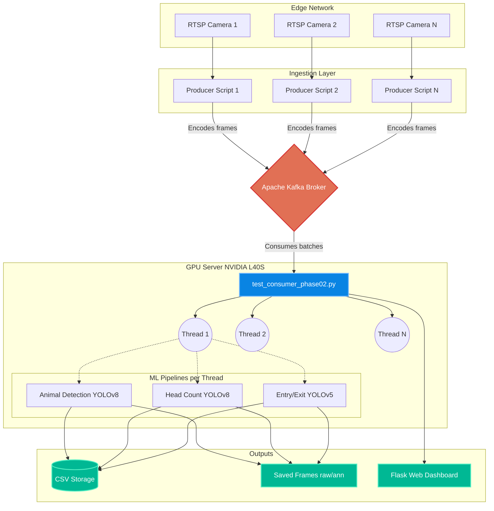

# Multi-Pipeline Video Inference Consumer

Welcome to the **Multi-Pipeline Consumer** repository! This project is a highly scalable, Kafka-driven video analytics pipeline designed to run real-time Machine Learning models on RTSP video streams. It is optimized to run on powerful GPU hardware (specifically NVIDIA L40S servers).

---

## 🏛 Architecture Overview

The system is decoupled into **Producers** (ingestion) and **Consumers** (inference), communicating via **Apache Kafka**. This ensures that heavy GPU processing never blocks the real-time camera ingestion.



---

## 📂 Codebase Structure

The repository is organized into specific domains to maintain separation of concerns.

| Directory | Purpose | Documentation |
| :--- | :--- | :--- |
| `consumers/` | The core intelligence engine. Contains scripts that pull from Kafka, manage GPU semaphores, and run ML inferences. | [Read More](consumers/README.md) |
| `producers/` | Lightweight ingestion scripts that connect to RTSP streams and push buffered frames to Kafka topics. | [Read More](producers/README.md) |
| `miscellaneous/` | Essential operational bash scripts for deployment, backups (`rsync`), and old output cleanup. | [Read More](miscellaneous/README.md) |
| `tests/` | Automated unit tests utilizing extensive mocking to run GPU logic on CI/CD CPU environments. | [Read More](tests/README.md) |
| `frame_saving_docs/`| Handover documentation requested by the ML team regarding frame-saving standards. | [Read More](frame_saving_docs/README.md) |
| `output/` *(Ignored)* | Automatically generated directory containing saved frames, bounding box CSVs, and videos. | N/A |
| `logs/` *(Ignored)* | Runtime logging output from the daemons. | N/A |

---

## 🚀 Production Deployment Guide

This system runs primarily via background Unix daemons. Below is the standard operating procedure for deploying, running, and stopping the pipelines in production.

### 1. Environment Setup
The project relies heavily on CUDA and PyTorch. Always activate the virtual environment before execution:
```bash
source venv/bin/activate
```

### 2. Starting the System
The system is deployed using `nohup` to ensure it continues running even if the SSH session disconnects.

**Step A: Start Producers**  
*(To start specific cameras, run their respective bash scripts)*
```bash
nohup ./miscellaneous/run_producers.sh > logs/producers_master.log 2>&1 &
```

**Step B: Start the Multi-Pipeline Consumer**  
*(Currently using `test_consumer_phase02.py` as the production standard)*
```bash
nohup python consumers/test_consumer_phase02.py > logs/nohup_consumer.log 2>&1 &
```

---

## 📊 Monitoring & Logs

Once started, the system operates completely autonomously. You can monitor its health using the following tools:

| Monitor Target | Command / URL | What to look for |
| :--- | :--- | :--- |
| **Consumer Logs** | `tail -f logs/nohup_consumer.log` | FPS drops, GPU memory allocations, Kafka offset commits. |
| **Producer Logs** | `tail -f logs/producers_master.log` | RTSP connection drops, frame ingestion rates. |
| **Active Processes** | `ps aux \| grep python` | Ensure your specific consumer and producer PIDs are alive. |
| **Live Video Feed** | `http://10.1.40.46:8675` | The Flask-SocketIO dashboard streaming live annotated feeds. |

---

## 🛑 Stopping the System
If you need to stop the pipelines (e.g., for an upgrade or maintenance):

1. **Find the Process IDs (PIDs):**
   ```bash
   ps aux | grep python
   ```
2. **Kill the processes gracefully:**
   ```bash
   kill -15 <PID>
   ```
   > [!WARNING]
   > Avoid using `kill -9` unless absolutely necessary. A hard kill prevents the script from saving graceful Kafka offset markers and closing CSV files cleanly.

---

## 🛠 File Output & Backups

The system generates several artifacts during execution:
- **Daily CSVs**: Stored in `output/<camera_name>/<pipeline>/csv/`.
- **Saved Frames (Raw/Annotated)**: Triggered upon positive detections to train future models.
- **Videos (.avi)**: Saved during inference intervals.

### Automated Backups
We utilize cron jobs and `rsync` to back up all CSV data to an external HPC cluster daily.
To configure this, run the setup script:
```bash
bash miscellaneous/setup_rsync_cron.sh
```

---

## 🤝 Code Standards & Best Practices

- **Never Commit Output/Logs:** The `.gitignore` file explicitly blocks `output/`, `logs/`, and `.pt` model files. **Do not bypass this.** Doing so will crash the GitHub repository due to file size limits.
- **Resource Locking:** Since the consumer is highly multi-threaded, always respect the `_pytorch_sem`, `_tf_sem`, and `_csv_lock` semaphores when writing new pipeline logic to prevent GPU Out-Of-Memory (OOM) errors and race conditions.
