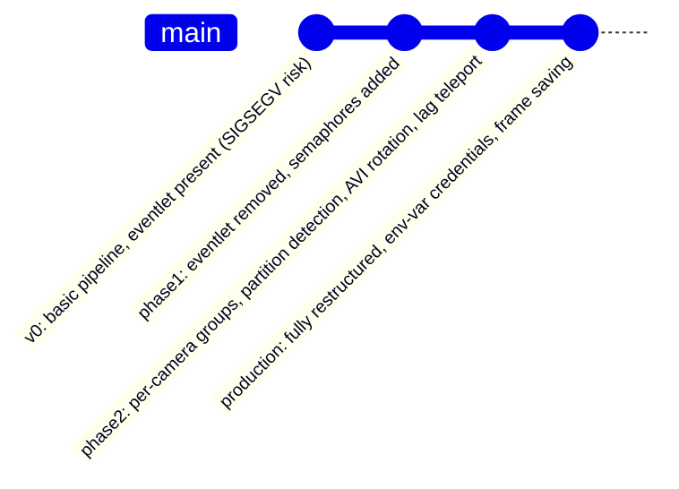

# `archive/`

Retired consumer iterations, kept for rollback reference only. None of these run in production —
the current production consumer is `consumers/consumer.py`.

---

## Contents

| File | Lines | Status |
|---|---|---|
| `consumer_v0.py` | 1,274 | Earliest iteration — **do not run against GPU/CUDA** |
| `consumer_v0_phase1.py` | 1,841 | Phase 1 — eventlet removed, semaphores introduced |
| `consumer_v0_phase2.py` | 2,012 | Phase 2 — per-camera groups, dominant-partition detection, AVI rotation added |
| `README.md` | — | This file |

---

## Evolution Timeline

---

## Version Comparison

| Feature | `consumer_v0.py` | `consumer_v0_phase1.py` | `consumer_v0_phase2.py` | `consumers/consumer.py` (production) |
|---|---|---|---|---|
| `eventlet.monkey_patch()` | **Present** — calls it directly (line 23), `async_mode='eventlet'` | Removed; guard `assert "eventlet" not in sys.modules` added | Removed; same guard | Removed; same guard |
| GPU semaphores (`_pytorch_sem`, `_tf_sem`) | Absent | Present | Present | Present — `_pytorch_sem = Semaphore(3)`, `_tf_sem = Semaphore(2)` |
| Per-camera Kafka `group_id` (`mlp_*`) | Absent | Absent | Present | Present |
| `detect_dominant_partition()` | Absent | Absent | Present | Present |
| Lag teleport / `seek_to_end()` | Basic seek only | Basic seek only | Present, `MAX_LAG_FRAMES = 54` — matches production exactly | Present — `MAX_LAG_FRAMES = 54` |
| AVI rotation | Absent | Absent | Present, `MAX_FRAMES_PER_AVI = 18000` — matches production exactly | Present — `MAX_FRAMES_PER_AVI = 18000` |

---

## Individual Notes

### `consumer_v0.py`
Earliest iteration (formerly `consumers/test_consumer.py`). **Predates the eventlet fix** — still
calls `eventlet.monkey_patch()`. Do not run against GPU/CUDA; it will reproduce the SIGSEGV crash
that `consumers/consumer.py`'s safety guard now prevents.

### `consumer_v0_phase1.py`
Phase 1 iteration (formerly `consumers/test_consumer_phase1.py`). Removes eventlet and adds the
`assert "eventlet" not in sys.modules` guard — safe to run for reference, but still predates the
Phase 2 fixes (dominant-partition detection, per-camera groups, AVI rotation).

### `consumer_v0_phase2.py`
Phase 2 iteration (formerly `consumers/test_consumer_phase2.py`). Adds dominant-partition
detection, per-camera consumer groups, lag-based `seek_to_end()` teleport (`MAX_LAG_FRAMES = 54`),
and AVI rotation (`MAX_FRAMES_PER_AVI = 18000`) — both values already match production exactly,
making this version functionally closest to production among the archived files.

---

The current production consumer lives at [`consumers/consumer.py`](../consumers/README.md).
