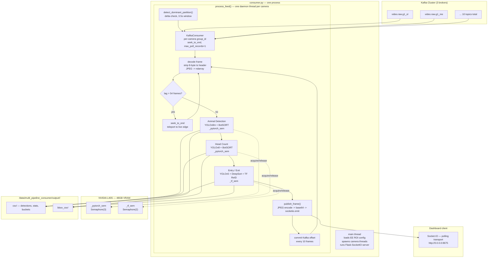
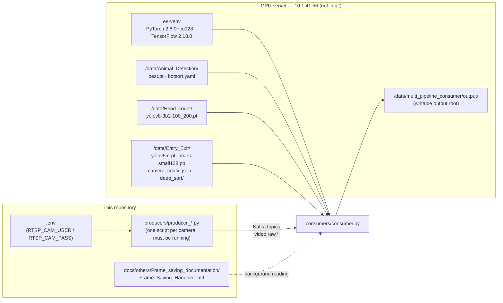

# `consumers/`

The intelligence core of the pipeline. One script — `consumer.py` — connects to Kafka,
pulls encoded video frames per camera, and runs three concurrent ML pipelines
(Animal Detection, Head Count, Entry/Exit) on an NVIDIA L40S GPU. Results are written to
disk as CSV metadata (video and raw/annotated JPEG image storage were disabled in the storage
overhaul — see "Output layout" below) and streamed live to a browser dashboard.

> **For non-technical readers:** this is the "brain" of the system. It watches
> live camera feeds, counts people and detects animals, tracks who enters/exits
> gated areas, and shows all of it on a live web dashboard. Everything else in
> this repo (`producers/`, `scripts/`) exists to feed data into this directory.

---

## Contents

| File | Status | Purpose |
|---|---|---|
| `consumer.py` | **Production** | Multi-threaded Kafka consumer, 3 ML pipelines, Flask-SocketIO dashboard |
| `README.md` | Current | This file |
| `__pycache__/` | Generated | Python bytecode cache — gitignored, ignore |

Older iterations (`consumer_v0*.py`) live in [`../archive/`](../archive/README.md), not here — kept for rollback only, not run in production.

---

## Architecture



> Video (`.avi`) and raw/annotated JPEG image storage were removed in the storage overhaul —
> only `csv/` and `bbox_csv/` are written to disk now. See "Output layout" below.

---

## Dependencies



`CAMERA_REGISTRY` in `consumer.py` (lines 185–196) is the single source of truth mapping Kafka topic → output folder → camera IP → enabled pipelines. Adding a camera means adding an entry here **and** a matching producer script.

---

## Technical Specs

### Kafka / consumer tuning

| Parameter | Value | Notes |
|---|---|---|
| Brokers | `10.1.40.43:9092,10.1.40.44:9093,10.1.40.45:9094` | 3-broker cluster |
| Topic naming | `video.raw.<camera_code>` | e.g. `video.raw.g1_ol` |
| Consumer group ID | `mlp_{topic.replace('.','_')}` | **Per-camera** — never shared, prevents rebalance cascades |
| `group_instance_id` (static membership) | Not set | `kafka-python` 2.x raises `KafkaConfigurationError` if passed — disabled intentionally |
| `auto_offset_reset` | `latest` | New consumer groups start at live edge, not history |
| `enable_auto_commit` | `False` | Manual commits only |
| `COMMIT_EVERY_N_FRAMES` | `10` | Max data loss on crash = 10 frames |
| `session_timeout_ms` | `15000` | Down from 60s in Phase 1 — faster crash detection |
| `heartbeat_interval_ms` | `3000` | Down from 20s |
| `max_poll_records` | `1` | One frame per poll — no batch accumulation |
| `max_poll_interval_ms` | `600000` | 10 min — generous, GPU inference can stall briefly |
| `fetch_max_bytes` | `52428800` (50MB) | |
| Dominant partition detection | Delta-check, 1.5s→3.5s snapshot window | Selects partition with active growth, not highest absolute offset — avoids dead historical partitions |
| Lag teleport threshold | `MAX_LAG_FRAMES = 54` (~3s at 18 FPS) | Beyond this, `seek_to_end()` instead of catching up frame-by-frame |
| Thread stagger on startup | 3s between camera threads | Prevents simultaneous partition-detection queries from saturating broker metadata API |

### GPU concurrency

| Semaphore | Value | Gates |
|---|---|---|
| `_pytorch_sem` | `Semaphore(3)` | Animal Detection + Head Count (YOLOv8/BotSORT) |
| `_tf_sem` | `Semaphore(2)` | Entry/Exit (YOLOv5 + TF ReID encoder) |

Tuned for L40S 48GB VRAM. PyTorch and TF run in isolated lanes to avoid cross-framework CUDA context interference. `torch.cuda.synchronize()` is called before releasing `_pytorch_sem` — without it, the semaphore wouldn't actually gate GPU execution (a new thread could submit a kernel while the GPU is still busy).

### Frame format

| Item | Value |
|---|---|
| Producer message | `struct.pack(">Q", int(time.time() * 1e9)) + jpeg_bytes` |
| Consumer unpack | `ts_ns = struct.unpack('>Q', msg.value[:8])[0]`; frame = `msg.value[8:]` |
| Working resolution | `FRAME_W=640 x FRAME_H=360` |
| Entry/Exit resolution | `EE_WIDTH=1024 x EE_HEIGHT=576` — ROI polygons in `camera_config.json` are calibrated to this, do not change without re-drawing ROIs |
| Video output | **Disabled** (storage overhaul) — was `.avi`, XVID codec, 18.0 FPS, rotating every 18,000 frames; the code is commented out in place in `consumer.py`, not deleted |

### Pipeline thresholds

| Pipeline | Confidence | Model | Tracker | Notes |
|---|---|---|---|---|
| Animal Detection (AN) | `0.45` | YOLOv8m, `imgsz=1280`, `half=True` | BotSORT (`botsort.yaml`) | Classes: `[0]` (animal) |
| Head Count (HC) | `0.30` | YOLOv8, `imgsz=640`, `half=True` | BotSORT | Classes: `[0]` (person). Bucketed avg written every `HC_INTERVAL_SEC=10s` |
| Entry/Exit (EE) | `0.45` | YOLOv5m | DeepSort + TF ReID (`mars-small128.pb`) | `max_cosine_dist=0.3`, `max_age=30`, `n_init=3`, `max_iou_dist=0.7`, batch size `4`, direction lookback `8` frames, dot-product threshold `3.0`, CSV flush every `300s` |

### Output layout

```
/data/multi_pipeline_consumer/output/<camera_folder>/
    animal_detection/{csv,bbox_csv}/
    head_count/{csv,bbox_csv}/
    entry_exit/{csv,bbox_csv}/
```

- **Storage overhaul (permanent):** video (`.avi`) and raw/annotated JPEG image storage are
  disabled for every camera and pipeline — only CSV metadata is written now. The `inference/`,
  `raw_frames/`, and `annotated_frames/` subfolders are no longer created at all. The disabled
  code is commented out in place in `consumer.py` (not deleted) so it's easy to find and audit;
  see the `cv2.imwrite`/`cv2.VideoWriter` call sites and the directory-creation block in
  `process_feed()`.
- CSVs are date-stamped via `_get_daily_csv_path()` — automatic midnight rotation, no cron needed.
- The main per-pipeline CSV and `bbox_csv/bboxes.csv` are unaffected by the storage overhaul —
  both still write on the same triggers as before (AN: any animal; HC: every frame for stats,
  `head_count > 0` for bbox rows; EE: entry/exit event for bbox rows, 300s interval for the
  summary CSV). See [`../docs/others/Frame_saving_documentation/Frame_Saving_Handover.md`](../docs/others/Frame_saving_documentation/Frame_Saving_Handover.md)
  for the original frame-saving handover doc (historical — describes the now-disabled behavior).

---

## ⚠️ TEMPORARY — GTA-Exp raw footage capture (remove after 2026-08-28)

This is a short-lived experiment layered on top of the permanent storage overhaul above — it
does **not** change AN/HC/EE pipeline behavior or the CSV-only output described in "Output
layout". It exists to collect ground-truth footage for model verification and should be deleted
once that's done.

| Item | Value |
|---|---|
| Scope | Exactly 4 cameras: `gate_1_outside_left`, `gate_1_main_entry`, `gate_2_entry_camera`, `gate_2_exit_camera` (`GTA_EXP_CAMERAS`) — no other camera is touched |
| Active dates | `2026-08-22` through `2026-08-28` inclusive (`GTA_EXP_START_DATE`/`GTA_EXP_END_DATE`) — hard cutoff in code, not just a manual stop |
| Daily windows | `09:00–10:00`, `14:30–15:30`, `19:00–20:00`, server local time, half-open `[start, end)` (`GTA_EXP_WINDOWS`) |
| Output location | `/data/multi_pipeline_consumer/output/GTA-Exp/<camera_folder>/<camera_folder>_<YYYYMMDD>_<window>.avi` |
| Format | Raw, unannotated footage — writes the pre-pipeline `frame` buffer, not the boxes/text-annotated `display` buffer. XVID codec, 18.0 FPS, 640×360 (same convention as the removed general video writer) |
| Gating function | `gta_exp_active_window(dt)` in `consumer.py` — pure function of a datetime + the constants above, unit-tested in `tests/test_gta_exp_capture.py` |
| Call site | `process_feed()`'s per-frame loop, right after frame decode/resize, before the (disabled) general AVI rotation block |
| Interaction with AN/HC/EE | None — the 4 gate cameras' existing pipelines (all `AN`/`HC`/`EE` = `True` per `CAMERA_REGISTRY`) keep running completely unchanged; this only adds a second, independent raw-video write |

**Follow-up required:** after 2026-08-28, delete the `GTA_EXP_*` constants, `gta_exp_active_window()`,
the call site in `process_feed()`, the `gta_writer`/`gta_current_window` state variables,
`tests/test_gta_exp_capture.py`, and this section — via a `hotfix/consumer/remove-gta-exp-capture`
(or `chore/`) branch. The hard date cutoff makes this safe to do at any point after the 28th
without losing any in-progress capture.

### Dashboard

| Item | Value |
|---|---|
| URL | `http://0.0.0.0:8675` |
| Transport | Socket.IO **polling only** (`transports: ['polling'], upgrade: false`) — Werkzeug dev server in threading mode does not support WebSocket upgrades; this was previously causing HTTP 500s on every reconnect |
| `async_mode` | `'threading'` — required for CUDA safety, do not change to `eventlet` or `gevent` |
| Snapshot endpoint | `GET /snapshot/<topic>` — latest JPEG as still image |
| Emit event | `frame` — `{cam, img (base64 JPEG), ts}`, room-scoped per camera topic |

---

## Critical constraints (production incidents — do not revert)

| Constraint | Why |
|---|---|
| No `eventlet` — guarded by `assert` at import time | `eventlet.monkey_patch()` caused SIGSEGV (exit 139) with CUDA/TF on this system |
| `async_mode='threading'` for SocketIO | Same CUDA-safety reason; WebSocket upgrade sacrificed for it |
| Per-camera Kafka `group_id` | Shared group IDs caused rebalance cascades that killed all camera threads simultaneously |
| `torch.cuda.synchronize()` before releasing `_pytorch_sem` | Without it, semaphore doesn't actually gate concurrent GPU kernel submission |
| AVI rotation every 18,000 frames *(historical — video storage now disabled)* | Long-running single files were corrupting (an 8.5GB frozen video was the trigger incident). No longer an active constraint since AVI writing was commented out in the storage overhaul, but recorded here in case video storage is ever re-enabled |
| Dominant partition via delta-check, not absolute offset | Absolute-offset selection was picking dead historical partitions — the "6 dead cameras" bug |

---

## How to Use

```bash
source venv/bin/activate          # local dev; production uses ee-venv on the GPU server

# Start (production standard)
nohup python consumers/consumer.py > logs/nohup_consumer.log 2>&1 &

# Monitor
tail -f logs/nohup_consumer.log

# Stop gracefully — allows offset commits + CSV flush to complete
kill -15 <PID>
# kill -9 only as last resort
```

Dashboard: `http://<server-ip>:8675`

---

## Known limitations / TODO markers in code

- `SKIP_FRAMES = 1` is a static no-op today; a comment marks it for a future dynamic lag-based skip (Phase 3, not yet implemented).
- EE pipeline runs without ROI gating (full-frame) if a camera's IP has no entry in `camera_config.json` — logged as a warning, not a hard failure.
- GPU utilization logging (via `pynvml`) is best-effort; failures leave the `gpu_utilization_pct` CSV column empty rather than crashing the thread.
