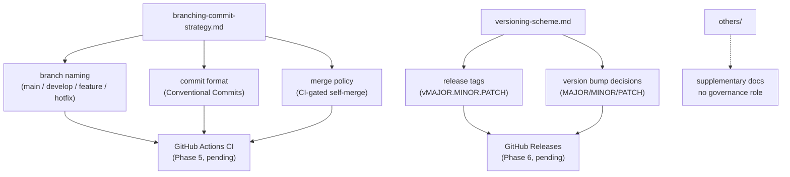

# `docs/`

Project-level governance documentation — how the repository is branched, committed to, and
versioned. These are locked standards, not proposals.

---

## Contents

| File | Status | Purpose |
|---|---|---|
| `branching-commit-strategy.md` | Locked (Phase 0) | GitFlow-lite branching model (`main`/`develop`/`feature`/`hotfix`), Conventional Commits format, CI-gated merge policy |
| `versioning-scheme.md` | Locked (Phase 0) | Semantic versioning rules (`vMAJOR.MINOR.PATCH`), what triggers each bump, `v1.0.0` baseline plan |
| `others/` | — | Supplementary, non-governance documentation (handover notes, reports) — see [`others/README.md`](others/README.md) |
| `README.md` | — | This file |

---

## Governance Structure

---

## Summary

### Branching (`branching-commit-strategy.md`)
- Two permanent branches: `main` (deployed/deployable) and `develop` (integration).
- Temporary branches: `feature/<area>/<short-desc>`, `hotfix/<short-desc>`.
- Commits follow Conventional Commits (`feat:`, `fix:`, `docs:`, `chore:`, `refactor:`, `test:`).
- Merge policy is CI-gated self-merge — CI gate enforcement pending Phase 5.

### Versioning (`versioning-scheme.md`)
- Format: `vMAJOR.MINOR.PATCH`, applied as a git tag at release-cut time.
- MAJOR = breaking change, MINOR = new capability (`feat:`), PATCH = bug fix (`fix:`).
- The current production consumer becomes the `v1.0.0` baseline — tag pending Phase 6.

---

See [`others/README.md`](others/README.md) for supplementary documentation not covered by these
governance rules.
