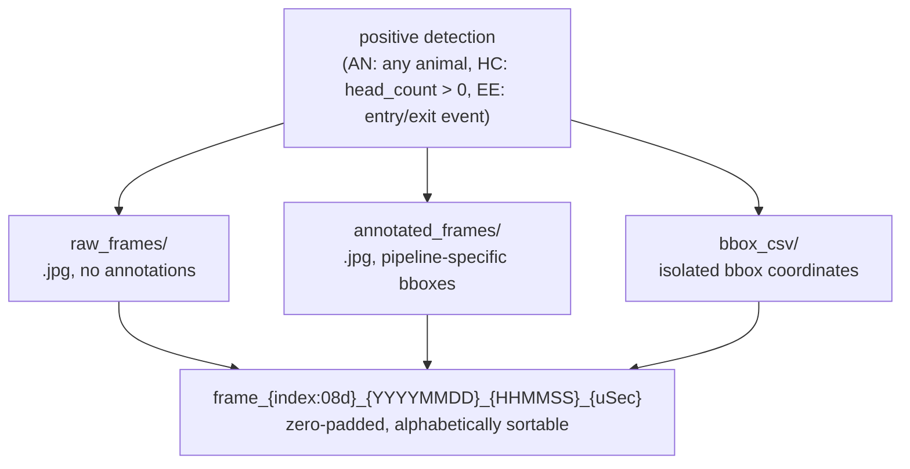

# `Frame_saving_documentation/`

Handover documentation for the Frame Saving Feature — production implementation lives in
`consumers/consumer.py`, this directory is historical/reference context only.

---

## Contents

| File | Purpose |
|---|---|
| `Frame_Saving_Handover.md` | Original deployment handover doc from the ML team's frame-saving feature integration (June 2026) |
| `README.md` | This file |

---

## Feature Flow

---

## Summary

- **Trigger:** Frame saving only fires on positive detections — blank frames incur zero I/O
  overhead. Trigger conditions: AN (any animal detected), HC (`head_count > 0`), EE (entry/exit
  event).
- **Additive only:** No existing CSV logic, Kafka handling, or dashboard WebSocket streaming was
  modified when this feature was added.
- **Performance tradeoff:** `cv2.imwrite` introduces blocking I/O during active detection frames.
  Considered acceptable given detections are sparse relative to total frame volume; the
  lag-dropping mechanism (`MAX_LAG_FRAMES = 54`) absorbs current load. Async writing is a
  documented future consideration if disk I/O becomes a bottleneck — not yet implemented.
- **Testing:** Covered by `tests/test_frame_saving.py` — see [`../../tests/README.md`](../../tests/README.md).
- **History:** Originally committed via the `script_changes_frames` branch (since merged and
  deleted). The feature was integrated during the Phase 2 repo restructure, when the target
  script was renamed from `test_consumer_phase02.py` to `consumers/consumer.py`.

Full details in [`Frame_Saving_Handover.md`](Frame_Saving_Handover.md).
