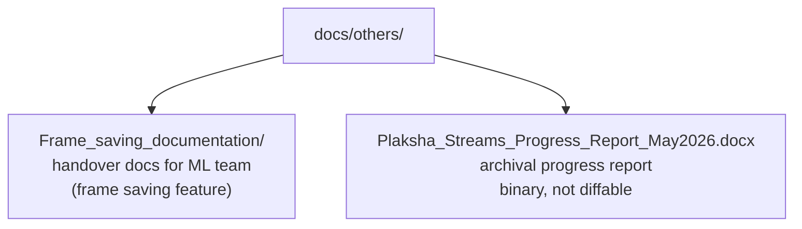

# `docs/others/`

Supplementary documentation that doesn't belong to core repository governance (branching,
commits, versioning — see [`../README.md`](../README.md)).

---

## Contents

| Item | Type | Purpose |
|---|---|---|
| `Frame_saving_documentation/` | Directory | Handover documentation for the ML team's frame-saving standards — see [`Frame_saving_documentation/README.md`](Frame_saving_documentation/README.md) |
| `Plaksha_Streams_Progress_Report_May2026.docx` | Binary (.docx) | Internal progress report from the initial consumer rollout — not version-controlled as text, opened externally |
| `README.md` | — | This file |

---

## Structure

---

## Note on `.docx`

`Plaksha_Streams_Progress_Report_May2026.docx` is a binary Word document (1.7MB). It is not
readable/diffable as text in this repo — it's tracked here as an archival snapshot, not living
documentation. Content changes to that report happen outside git.
