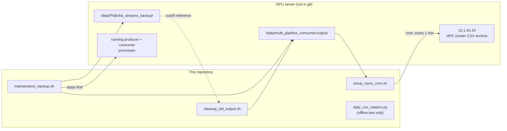

# Miscellaneous Utilities

This directory holds the essential bash scripts used for operating the system in a production environment, as well as maintaining the data artifacts generated by the ML pipelines.

## Scripts Overview

### `setup_rsync_cron.sh`
Configures a server-level cron job (runs every minute) that synchronizes CSV data — via `rsync` with
an `--include="*.csv"` filter — from the L40S GPU server to a secondary HPC cluster
(`10.1.40.43:/home/administrator/plaksha_streams_hpc1/plaksha_day_wise_csv`) for permanent storage.
It syncs CSV files only; saved frames/images are not included.

### `cleanup_old_output.sh`
A cron-friendly script used to clean out old frames and logs from the `output/` directory that have already been backed up by the `rsync` script. This prevents the primary GPU server from running out of disk space.

### `maintenance_backup.sh`
A manual trigger script to perform ad-hoc backups of the data directory before pushing risky updates or taking the system offline.

### `daily_csv_rotation.py`
A standalone, isolated **test** that verifies `consumer.py`'s `_get_daily_csv_path()` /
`StreamingCSVWriter` rotation logic against a temp directory — it has no Kafka/GPU/model
dependencies. It does not touch real output and performs no rotation itself; actual daily rotation
happens automatically inside `consumers/consumer.py` on every CSV write. (Formerly
`consumers/test_daily_csv_rotation.py`.)

`run_consumer.sh` and `run_producers.sh` now live in `scripts/`, see `scripts/README.md`.

## Dependencies

## Legacy Documentation
Moved to `docs/others/`, see `docs/others/README.md`.
