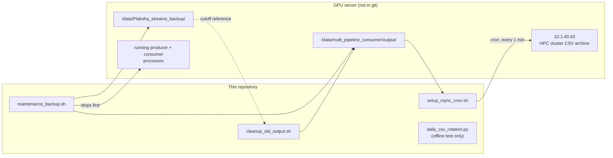

# Miscellaneous Utilities

This directory holds the essential bash scripts used for operating the system in a production environment, as well as maintaining the data artifacts generated by the ML pipelines.

---

## Contents

| File | Type | Purpose |
|---|---|---|
| `maintenance_backup.sh` | Bash | Stops producers + consumer, backs up `output/` and `logs/` to a timestamped directory, verifies backup via file-count comparison — no deletion |
| `setup_rsync_cron.sh` | Bash | One-time setup: SSH key, passwordless auth to HPC-1, installs a cron job syncing CSVs every minute |
| `cleanup_old_output.sh` | Bash | Deletes output files older than the latest backup's mtime — mandatory dry-run + typed `DELETE` confirmation before any deletion |
| `daily_csv_rotation.py` | Python (offline test) | Standalone isolated test of `_get_daily_csv_path()` / `StreamingCSVWriter` rotation logic — no Kafka/GPU/model dependencies, does not touch real output |
| `README.md` | — | This file |

## Scripts Overview

### `setup_rsync_cron.sh`
Configures a server-level cron job (runs every minute) that synchronizes CSV data — via `rsync` with
an `--include="*.csv"` filter — from the L40S GPU server to a secondary HPC cluster
(`10.1.40.43:/home/administrator/plaksha_streams_hpc1/plaksha_day_wise_csv`) for permanent storage.
It syncs CSV files only; saved frames/images are not included.

### `cleanup_old_output.sh`
A cron-friendly script used to clean out old frames and logs from the `output/` directory that have already been backed up by the `rsync` script. This prevents the primary GPU server from running out of disk space.

### `maintenance_backup.sh`
A manual trigger script to perform ad-hoc backups of the data directory before pushing risky updates or taking the system offline.

### `daily_csv_rotation.py`
A standalone, isolated **test** that verifies `consumer.py`'s `_get_daily_csv_path()` /
`StreamingCSVWriter` rotation logic against a temp directory — it has no Kafka/GPU/model
dependencies. It does not touch real output and performs no rotation itself; actual daily rotation
happens automatically inside `consumers/consumer.py` on every CSV write. (Formerly
`consumers/test_daily_csv_rotation.py`.)

`run_consumer.sh` and `run_producers.sh` now live in `scripts/`, see `scripts/README.md`.

---

## Technical Specs

### `maintenance_backup.sh`

| Parameter | Value | Notes |
|---|---|---|
| `SOURCE_BASE` | `/data/multi_pipeline_consumer` | Root of production data |
| `OUTPUT_DIR` | `$SOURCE_BASE/output` | Backed up, never modified |
| `LOG_DIR` | `$SOURCE_BASE/logs` | Backed up, never modified |
| `BACKUP_ROOT` | `/data/Plaksha_streams_backup` | Destination; one timestamped subdir per run (`YYYY-MM-DD_HHMMSS`) |
| `GRACEFUL_WAIT` | `15s` | Wait after SIGTERM before verifying/force-killing producers and consumer |
| `STOP_POLL` | `2s` | Declared but unused — no functional effect |
| Consumer kill pattern | `pkill -f "test_consumer_phase"` | **Known quirk:** stale process name from before the Phase 2 rename to `consumers/consumer.py` — this pattern will not match the current production process |
| Safety contract | No `rm`/delete/truncate anywhere; exits non-zero on backup verification failure | Verified by file-count comparison between source and backup |

### `setup_rsync_cron.sh`

| Parameter | Value | Notes |
|---|---|---|
| `SOURCE_DIR` | `/data/multi_pipeline_consumer/output` | Synced from |
| `DEST_HOST` | `10.1.40.43` | HPC-1 |
| `DEST_USER` | `administrator` | |
| `DEST_DIR` | `/home/administrator/plaksha_streams_hpc1/plaksha_day_wise_csv` | Synced to |
| `LOG_FILE` | `/data/multi_pipeline_consumer/logs/rsync_backup.log` | |
| `SSH_KEY` | `~/.ssh/id_ed25519` (Ed25519, no passphrase) | Required for unattended cron execution |
| Cron schedule | `* * * * *` (every 1 minute) | Installed via `crontab -` after dry-run confirmation |
| Rsync filter | `--include="*/" --include="*.csv" --exclude="*"` | CSVs only — frames/videos never synced by this script |
| Rsync flags | `-az --update --itemize-changes` | Compressed, only-if-newer, one-shot dry-run before install |

### `cleanup_old_output.sh`

| Parameter | Value | Notes |
|---|---|---|
| `OUTPUT_DIR` | `/data/multi_pipeline_consumer/output` | Deletion target |
| `BACKUP_ROOT` | `/data/Plaksha_streams_backup` | Cutoff source — never modified |
| Cutoff logic | Most recent `$BACKUP_ROOT/20*/` directory's mtime, via `find ... ! -newer` | No filename guessing — files newer than the backup are always protected |
| Confirmation | Must type `DELETE` (exact, case-sensitive) | No `-f`/force flag exists to skip this |
| Safety contract | Mandatory dry-run listing (files + total size) before any deletion prompt | Backup directory itself is never touched |

### `daily_csv_rotation.py`

| Parameter | Value | Notes |
|---|---|---|
| Test count | 17 checks (`T1`–`T17`) across `_get_daily_csv_path()`, `StreamingCSVWriter`, and camera-nomenclature sampling | Pass/fail counted and printed, not pytest-based — run directly with `python3` |
| Dependencies | stdlib only (`os`, `csv`, `threading`, `tempfile`, `datetime`, `unittest.mock`) | No Kafka/GPU/model imports |
| Concurrency test | 20 threads writing concurrently (`T16`) | Verifies `threading.Lock()` prevents row corruption |

---

## Dependencies

Verified against all 4 files — diagram is accurate, no changes needed.

## Legacy Documentation
Moved to `docs/others/`, see `docs/others/README.md`.
