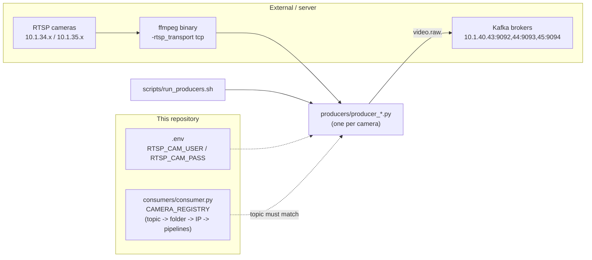

# Producer Module

This directory contains the ingestion scripts responsible for capturing live RTSP feeds and forwarding them into the Kafka broker.

## How It Works

Each camera on campus has its own dedicated python script (e.g., `producer_gate_1_main_entry.py`).
These scripts spawn an `ffmpeg` subprocess (`-rtsp_transport tcp`) to pull raw BGR24 frames from the
RTSP URL. OpenCV (`cv2.imencode`) is used only to JPEG-encode each frame before publishing — it does
not perform the RTSP capture itself.

1. **Frame Extraction**: Frames are read from the `ffmpeg` subprocess's stdout pipe.
2. **Per-frame publish**: Each frame is JPEG-encoded and sent as its own Kafka message immediately —
   there is no application-level batching. The Kafka producer uses `linger_ms=5` client-side buffering
   only (a producer-library optimization, not frame aggregation).
3. **Kafka Publishing**: The frames are published to a specific Kafka topic matching the camera's location.

---

## Contents

| File | Camera | Kafka Topic | Location / Area | Pipelines Enabled |
|---|---|---|---|---|
| `producer_gate_1_outside_left.py` | Gate 1 — Outside Left | `video.raw.g1_ol` | Gate 1, outside/left approach | AN, HC, EE |
| `producer_gate_1_main_entry.py` | Gate 1 — Main Entry | `video.raw.g1_me` | Gate 1, main entry | AN, HC, EE |
| `producer_gate_2_entry_camera.py` | Gate 2 — Entry | `video.raw.g2_en` | Gate 2, entry side | AN, HC, EE |
| `producer_gate_2_exit_camera.py` | Gate 2 — Exit | `video.raw.g2_ex` | Gate 2, exit side | AN, HC, EE |
| `producer_a2_gf_electronic_zone.py` | A2 GF — Electronic Zone | `video.raw.a2_ez` | Academic Block 2, ground floor, electronics zone | HC |
| `producer_a2_gf_makerspace_worktops.py` | A2 GF — Makerspace Worktops | `video.raw.a2_mk` | Academic Block 2, ground floor, makerspace worktops | HC |
| `producer_dr2_1f_dining_area_1.py` | DR2 1F — Dining Area 1 | `video.raw.dr2_da1` | Dining Block 2, first floor, dining area 1 | HC |
| `producer_dr2_gf_dining_cam_2.py` | DR2 GF — Dining Cam 2 | `video.raw.dr2_dc2` | Dining Block 2, ground floor, dining camera 2 | HC |
| `producer_d58_summer_court_2.py` | D58 — Summer Court 2 | `video.raw.sc_d58` | Block D58, summer court 2 | AN, HC |
| `producer_gh_gf_outdoor_dining_area_1.py` | GH GF — Outdoor Dining Area 1 | `video.raw.gh_od1` | Guest House, ground floor, outdoor dining area 1 | AN |
| `README.md` | — | — | — | — |

Pipeline flags (AN = Animal Detection, HC = Head Count, EE = Entry/Exit) are sourced from
`CAMERA_REGISTRY` in `consumers/consumer.py` (lines 185–196) — the single source of truth.
Producer scripts themselves have no pipeline awareness; enablement is entirely consumer-side.

---

## Message Format

Every message is `struct.pack(">Q", int(time.time() * 1e9)) + jpeg_bytes` — an 8-byte big-endian
nanosecond timestamp header followed by the JPEG payload. `consumers/consumer.py` unpacks this via
`ts_ns = struct.unpack('>Q', msg.value[:8])[0]`, frame bytes from `msg.value[8:]`.

---

## Technical Specs

### RTSP / FFmpeg

| Parameter | Value | Notes |
|---|---|---|
| RTSP URL format | `rtsp://<RTSP_CAM_USER>:<RTSP_CAM_PASS>@<camera_ip>:554/cam/realmonitor?channel=1&subtype=1` | Credentials assembled from env vars at runtime, never hardcoded |
| RTSP transport | `-rtsp_transport tcp` | Forces TCP over UDP for reliability |
| Output pixel format | `-pix_fmt bgr24`, `-vcodec rawvideo` | Raw frames piped to stdout, no container |
| Output mode | `-f image2pipe` | Frame stream via subprocess pipe, not a file |
| Scale filter | `-vf scale=640:480` | Resizes to `WIDTH=640 x HEIGHT=480` before piping |
| FFmpeg logging | `-loglevel quiet`, `stderr=subprocess.DEVNULL` | Suppresses connection-error spam on terminal |
| JPEG quality | `95` | `cv2.IMWRITE_JPEG_QUALITY` on encode, applied after FFmpeg pipes raw BGR24 |

### Kafka

| Parameter | Value | Notes |
|---|---|---|
| Kafka brokers | `10.1.40.43:9092,10.1.40.44:9093,10.1.40.45:9094` | 3-broker cluster |
| `acks` | `0` (fire-and-forget) | Acceptable — occasional dropped frame is tolerable for video |
| `linger_ms` | `5` | Client-side send buffering only, not frame batching |
| Message key | Topic name (UTF-8 encoded) | Used as the Kafka partition key |
| Error handling | `future.add_errback(...)` logs send failures | Does not block or retry — fire-and-forget |

### Restart Behavior

Producers have two independent restart layers:

| Layer | Trigger | Delay | Notes |
|---|---|---|---|
| **Inner (FFmpeg pipe)** | No frame within `FRAME_TIMEOUT_SEC=5.0s`, or incomplete frame read (`len(raw) != frame_size`) | `RESTART_DELAY_SEC=2s` | `_safe_kill()` closes stdout, sends SIGTERM, waits 5s, force-kills if unresponsive — then a fresh FFmpeg subprocess is spawned. The Python process itself does not exit. |
| **Outer (process-level)** | Producer Python process crashes/exits | `5s` | Handled by `scripts/run_producers.sh`, not the producer script itself — see [`../scripts/README.md`](../scripts/README.md) |

RTSP credentials, camera env vars, and message format are shared across all 10 scripts —
structurally identical except RTSP IP, Kafka topic, and logger name.

---

## Dependencies

Verified against all 10 producer files and `CAMERA_REGISTRY` — diagram is accurate, no changes
needed.

---

## Scalability and Design

The separation of Producers from Consumers allows the system to scale massively:
- Producers do very little computational work, meaning dozens can be run on a low-end CPU server.
- If the GPU Consumer crashes, the Producers continue buffering frames into Kafka, ensuring zero data loss during restarts.

## Adding a New Camera
To add a new camera stream to the network:
1. Duplicate an existing producer script.
2. Update the `RTSP_URL` and the Kafka `TOPIC` string inside the script.
3. Add the new topic to the `CAMERA_REGISTRY` in the consumer script.
4. Run the new producer script.
