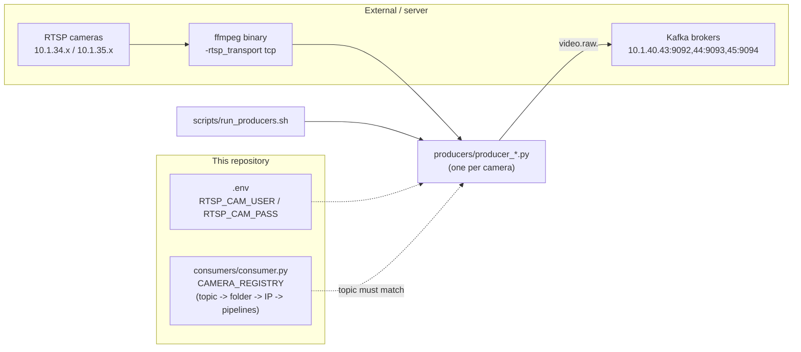

# Producer Module

This directory contains the ingestion scripts responsible for capturing live RTSP feeds and forwarding them into the Kafka broker.

## How It Works

Each camera on campus has its own dedicated python script (e.g., `producer_gate_1_main_entry.py`).
These scripts spawn an `ffmpeg` subprocess (`-rtsp_transport tcp`) to pull raw BGR24 frames from the
RTSP URL. OpenCV (`cv2.imencode`) is used only to JPEG-encode each frame before publishing — it does
not perform the RTSP capture itself.

1. **Frame Extraction**: Frames are read from the `ffmpeg` subprocess's stdout pipe.
2. **Per-frame publish**: Each frame is JPEG-encoded and sent as its own Kafka message immediately —
   there is no application-level batching. The Kafka producer uses `linger_ms=5` client-side buffering
   only (a producer-library optimization, not frame aggregation).
3. **Kafka Publishing**: The frames are published to a specific Kafka topic matching the camera's location.

## Message Format

Every message is `struct.pack(">Q", int(time.time() * 1e9)) + jpeg_bytes` — an 8-byte big-endian
nanosecond timestamp header followed by the JPEG payload. `consumers/consumer.py` unpacks this.

## Configuration

| Parameter | Value |
|---|---|
| Frame resolution | 640×480 |
| JPEG quality | 95 |
| Kafka brokers | `10.1.40.43:9092,10.1.40.44:9093,10.1.40.45:9094` |
| `acks` | `0` (fire-and-forget) |
| RTSP credentials | `RTSP_CAM_USER` / `RTSP_CAM_PASS` env vars, loaded from repo-root `.env` — never hardcoded |

## Dependencies

## Scalability and Design

The separation of Producers from Consumers allows the system to scale massively:
- Producers do very little computational work, meaning dozens can be run on a low-end CPU server.
- If the GPU Consumer crashes, the Producers continue buffering frames into Kafka, ensuring zero data loss during restarts.

## Adding a New Camera
To add a new camera stream to the network:
1. Duplicate an existing producer script.
2. Update the `RTSP_URL` and the Kafka `TOPIC` string inside the script.
3. Add the new topic to the `CAMERA_REGISTRY` in the consumer script.
4. Run the new producer script.
