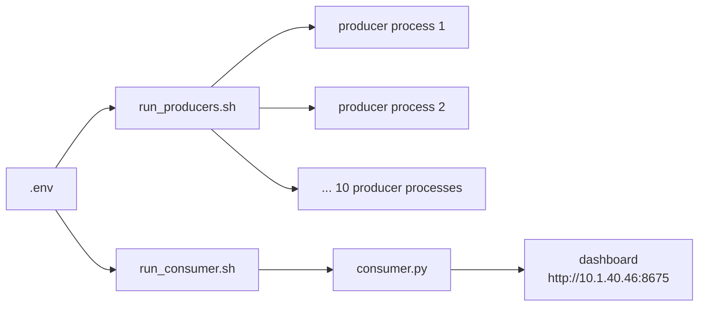

# `scripts/`

Operational entry-point scripts for starting the pipeline in production. Both scripts are
auto-restart wrappers around the actual Python processes — they are not one-shot launchers.

---

## Contents

| File | Purpose |
|---|---|
| `run_producers.sh` | Launches all 10 camera producers, one background subshell each, with individual crash-restart loops |
| `run_consumer.sh` | Launches `consumers/consumer.py` with a crash-restart loop and exit-code diagnostics |
| `README.md` | This file |

---

## Flow



---

## `run_producers.sh`

Starts all 10 producer scripts, each in its own backgrounded subshell with an independent
auto-restart loop (crash → wait → relaunch, forever). Also runs a status-check loop every 5
minutes that logs OK/DEAD per producer.

| Parameter | Value | Notes |
|---|---|---|
| Producer count | `10` | Hardcoded list in the script |
| Restart delay on crash | `5s` | Per-producer, independent of other producers |
| Launch stagger | `1s` | Between starting each producer, to avoid simultaneous RTSP connection bursts |
| Status check interval | `300s` (5 min) | Logs OK/DEAD per producer PID |
| Venv path | `/data/Entry_Exit/ee-venv` | Confirmed from direct server inspection |
| Producers dir | `/data/multi_pipeline_consumer/producers` | Production path, GPU server only |
| Log dir | `/data/multi_pipeline_consumer/logs` | One timestamped log file per producer + a master log |
| Env vars | Loaded from repo-root `.env` via `set -a && source .env && set +a` | RTSP credentials |

Usage:
```bash
nohup ./scripts/run_producers.sh > logs/producers_master.log 2>&1 &
```

To stop all producers: `kill $(cat /data/multi_pipeline_consumer/logs/producer_*.pid)`.

---

## `run_consumer.sh`

Starts `consumers/consumer.py` with a crash-restart loop. Decodes common exit codes (0 = clean
exit/no restart, 1 = Python exception, 137 = SIGKILL/OOM, 139 = segfault) into the log for faster
triage.

| Parameter | Value | Notes |
|---|---|---|
| Restart delay on crash | `10s` | Does not restart on clean exit (code 0) — treated as intentional stop |
| Venv path | `/data/Entry_Exit/ee-venv` | Confirmed from direct server inspection |
| Consumer script path | `/data/multi_pipeline_consumer/consumers/consumer.py` | Production path, GPU server only |
| Log file | `logs/consumer_<session_timestamp>.log` | One per launcher session |
| CUDA env vars | `XLA_FLAGS=--xla_gpu_cuda_data_dir=/usr/local/cuda`, `PATH` prepended with `/usr/local/cuda/bin` | Set before every launch |
| Dashboard URL | `http://10.1.40.46:8675` | Note: script logs stale IP 10.1.41.56 — actual dashboard is at 10.1.40.46:8675, fix pending |

Usage:
```bash
nohup python consumers/consumer.py > logs/nohup_consumer.log 2>&1 &
# or, with auto-restart:
nohup ./scripts/run_consumer.sh > logs/nohup_consumer.log 2>&1 &
```

Stop with `kill -15 <PID>` — allows clean Kafka offset commits and CSV flushes. `kill -9` only as
last resort.
