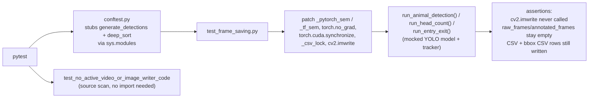

# `tests/`

Automated unit tests for the ML pipeline logic — file saving, CSV writing, and math logic —
run without GPU/CUDA hardware.

---

## Contents

| File | Purpose |
|---|---|
| `conftest.py` | Not a test — stubs `generate_detections` and `deep_sort` (normally loaded from `/data/Entry_Exit` on the GPU server) via `sys.modules`, so `consumers.consumer` can be imported anywhere |
| `test_frame_saving.py` | Verifies `run_animal_detection`/`run_head_count`/`run_entry_exit` do **not** write raw/annotated JPEGs (video/image storage is disabled — CSV-only output), while CSV and bbox CSV writes still happen correctly; plus a static guard against any active `cv2.VideoWriter`/`cv2.imwrite` call reappearing in `consumer.py` |
| `README.md` | This file |

---

## Test Execution Flow



---

## Philosophy

Testing computer vision pipelines that rely on hardware acceleration (CUDA) and heavy models
(YOLO, TensorFlow) is difficult in standard CI/CD because those environments rarely have GPU
access. This suite mocks out the heavy YOLO inference calls, the PyTorch semaphore
(`_pytorch_sem`), and CUDA synchronization — so file-saving and CSV logic can be tested in
milliseconds on any CPU machine.

`tests/conftest.py` stubs two imports specifically: `generate_detections` and `deep_sort`, both
normally loaded from `/data/Entry_Exit` on the production GPU server. It does **not** stub
`numpy`, `opencv-python`, `torch`, `tensorflow`, `ultralytics`, `flask-socketio`, `pynvml`, or
`kafka-python` — those are real dependencies from `requirements.txt` and must actually be
installed (CPU wheels are fine; no GPU/CUDA hardware required) for `consumers.consumer` to
import successfully.

---

## Running the Tests

```bash
pip install -r requirements-dev.txt -r requirements.txt
pytest tests/
```

Run a single file or test:
```bash
pytest tests/test_frame_saving.py -v
pytest tests/test_frame_saving.py::test_animal_detection_no_image_storage -v
```

CI (`.github/workflows/ci.yml`) runs `ruff check` and this full suite on every push/PR to
`main`/`develop`, on Python 3.11 with CPU-only dependencies from `requirements-ci.txt` (see that
file's header for why `requirements.txt` itself isn't installable on CI runners).

---

## Key Tests

### `test_frame_saving.py`

Video and raw/annotated JPEG image storage were removed from `consumer.py` in the storage
overhaul — only CSV metadata (main per-pipeline CSV + `bbox_csv/bboxes.csv`) is written now. This
file's name is kept (it's still about frame-saving *behavior*, now testing its absence).

| Test | Verifies |
|---|---|
| `test_animal_detection_no_image_storage` | On a mocked detection, `run_animal_detection` never calls `cv2.imwrite`, leaves `raw_frames`/`annotated_frames` empty, and still writes the main CSV + bbox CSV rows |
| `test_head_count_no_image_storage` | On a mocked head detection, `run_head_count` never calls `cv2.imwrite`, leaves `raw_frames`/`annotated_frames` empty, and still writes the per-frame stats CSV (via `stats_writer.write`) + bbox CSV row |
| `test_entry_exit_no_image_storage` | On a mocked ENTRY crossing (pre-populated `track_history` drives the dot-product threshold, independent of raw YOLO detections that frame), `run_entry_exit` never calls `cv2.imwrite`, leaves `raw_frames`/`annotated_frames` empty, and still writes the bbox CSV row for the event |
| `test_no_active_video_or_image_writer_code` | Static source scan (no import) — fails if any non-commented line in `consumer.py` contains an active `cv2.VideoWriter(`, `video_writer.write(`, or `cv2.imwrite(` call, guarding against silently re-enabling storage |

The three functional tests patch `consumers.consumer._pytorch_sem` / `_tf_sem`, `torch.no_grad`,
`torch.cuda.synchronize` (plus `torch.cuda.memory_allocated`/`memory_reserved` for
`run_head_count`, which reads live CUDA memory stats even on a CPU test machine), `_csv_lock`,
and `cv2.imwrite` — all current call sites in `consumers/consumer.py` at time of writing, so the
patch targets are current, not stale. The `run_entry_exit` test mocks the tracker directly
(`tracker.tracks`) rather than exercising real DeepSort matching, and passes zero raw YOLO boxes
that frame — the ENTRY event is driven purely by the pre-seeded `track_history`, which sidesteps a
mocking quirk in `conftest.py`'s bare-`MagicMock` stub of `deep_sort.detection.Detection` (calling
it positionally is intercepted by `MagicMock.__init__`'s own `spec` parameter).

### `conftest.py`

Not a test. Stubs `generate_detections` (`create_box_encoder`) and the `deep_sort` package
(`nn_matching.NearestNeighborDistanceMetric`, `detection.Detection`, `tracker.Tracker`) as
`MagicMock` objects registered directly in `sys.modules`, so `import consumers.consumer` does
not raise `ModuleNotFoundError` off the production server.
