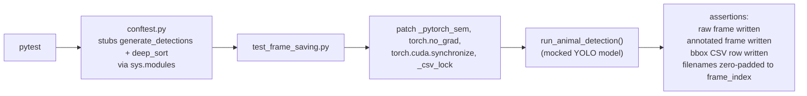

# `tests/`

Automated unit tests for the ML pipeline logic — file saving, CSV writing, and math logic —
run without GPU/CUDA hardware.

---

## Contents

| File | Purpose |
|---|---|
| `conftest.py` | Not a test — stubs `generate_detections` and `deep_sort` (normally loaded from `/data/Entry_Exit` on the GPU server) via `sys.modules`, so `consumers.consumer` can be imported anywhere |
| `test_frame_saving.py` | Verifies `run_animal_detection` saves raw frame, annotated frame, and bbox CSV correctly on a positive detection |
| `README.md` | This file |

---

## Test Execution Flow



---

## Philosophy

Testing computer vision pipelines that rely on hardware acceleration (CUDA) and heavy models
(YOLO, TensorFlow) is difficult in standard CI/CD because those environments rarely have GPU
access. This suite mocks out the heavy YOLO inference calls, the PyTorch semaphore
(`_pytorch_sem`), and CUDA synchronization — so file-saving and CSV logic can be tested in
milliseconds on any CPU machine.

`tests/conftest.py` stubs two imports specifically: `generate_detections` and `deep_sort`, both
normally loaded from `/data/Entry_Exit` on the production GPU server. It does **not** stub
`numpy`, `opencv-python`, `torch`, `tensorflow`, `ultralytics`, `flask-socketio`, `pynvml`, or
`kafka-python` — those are real dependencies from `requirements.txt` and must actually be
installed (CPU wheels are fine; no GPU/CUDA hardware required) for `consumers.consumer` to
import successfully.

---

## Running the Tests

```bash
pip install -r requirements-dev.txt -r requirements.txt
pytest tests/
```

Run a single file or test:
```bash
pytest tests/test_frame_saving.py -v
pytest tests/test_frame_saving.py::test_animal_detection_frame_saving -v
```

There is currently no CI workflow configured in this repository (no `.github/workflows/`) —
tests are run manually.

---

## Key Tests

### `test_frame_saving.py`

| Test | Verifies |
|---|---|
| `test_animal_detection_frame_saving` | On a mocked detection (`mock_model.track` returns one box), `run_animal_detection` writes exactly one raw frame, one annotated frame, and one bbox CSV row, all filenamed with the zero-padded frame index (`frame_00000042_...`) |

The test patches `consumers.consumer._pytorch_sem`, `torch.no_grad`, `torch.cuda.synchronize`,
and `_csv_lock` — all four still exist in `consumers/consumer.py` at time of writing
(`_pytorch_sem = Semaphore(3)`, `_csv_lock` used at 3 call sites for CSV writes), so the patch
targets are current, not stale. The test does not exercise real semaphore gating or GPU
synchronization — only the file-writing path downstream of them.

### `conftest.py`

Not a test. Stubs `generate_detections` (`create_box_encoder`) and the `deep_sort` package
(`nn_matching.NearestNeighborDistanceMetric`, `detection.Detection`, `tracker.Tracker`) as
`MagicMock` objects registered directly in `sys.modules`, so `import consumers.consumer` does
not raise `ModuleNotFoundError` off the production server.
